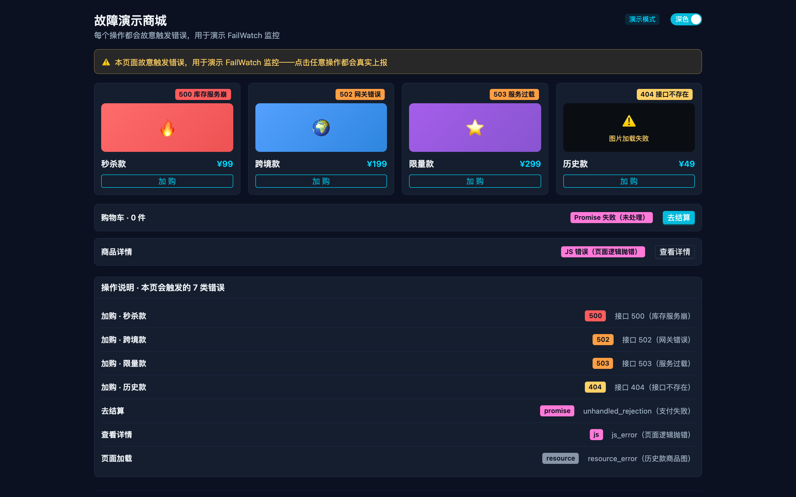
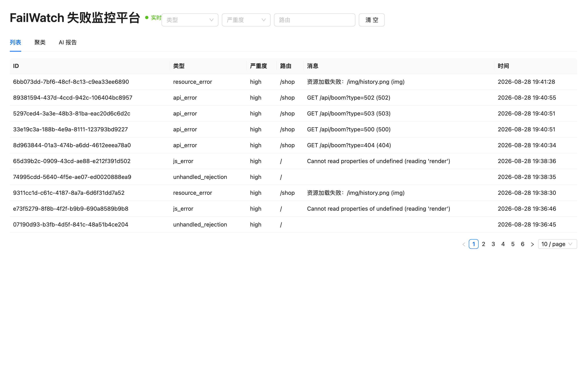
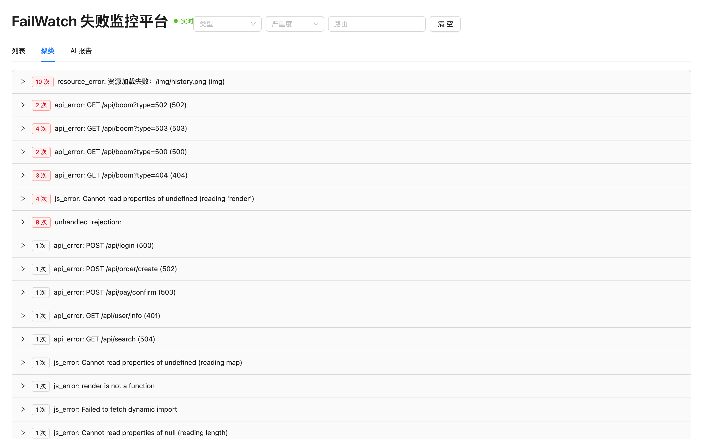
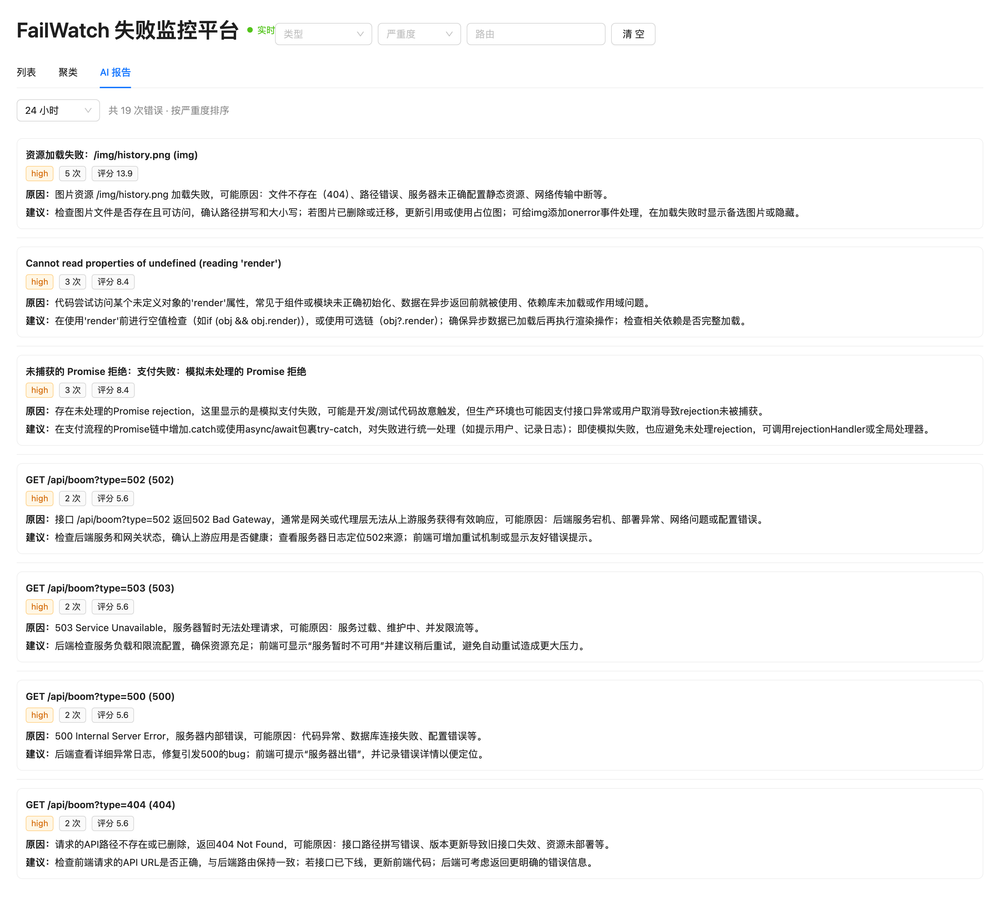

# FailWatch（失败监控平台）

一个**前端失败监控平台**（迷你 Sentry）：采集网页上的 JS 运行时错误、未捕获的 Promise 拒绝、接口 4xx/5xx、资源加载失败，统一上报后端存储，在 Dashboard 看板展示，并由 AI 生成每日整合报告与调整建议。

## 为什么做这个项目

此前在业务中使用 skyeye 只做**访问统计 / 功能使用统计**，前端失败与后端失败完全是盲区——页面出错了、接口 500 了，没有数据可查。FailWatch 就是为了补上这块盲区：把"失败"变成可采集、可存储、可分析、可改进的数据。

## 架构与数据流

```
用户网页出错
   │  SDK（前端采集包）捕获，打包成 FailureEvent
   ▼
POST 上报
   │  collector（后端）Zod 校验 → 存 Neon Postgres
   ▼
Dashboard 看板（web）查询展示
   │
   ▼
AI 每日/区间整合报告（DeepSeek 真实归因 + mock 降级）
```

核心设计：全链路共享**同一份 `FailureEvent` 类型定义**（`packages/sdk/src/types.ts`，判别联合 discriminated union），SDK / collector / web 三处直接 import，改一处编译期三处同步，杜绝"字段对不上"。

## 目录结构（pnpm monorepo）

```
failwatch/
├── packages/
│   ├── sdk/          # 前端采集 SDK：捕获失败事件，定义共享类型
│   ├── collector/    # 后端服务：接收上报、校验（Zod）、存储（Neon Postgres）
│   └── web/          # Dashboard 看板（React + Vite + antd）
├── examples/
│   └── demo-app/     # 示例应用：演示 SDK 采集与上报
├── pnpm-workspace.yaml
├── package.json
└── .gitignore
```

## 技术栈

| 层 | 技术 |
|---|---|
| 仓库组织 | pnpm workspace monorepo（本地软链接共享，无需发版） |
| 语言 | TypeScript（strict） |
| SDK | 原生 TS，无框架依赖 |
| collector | Node.js + Express + Zod（运行时校验）+ postgres.js + Neon Postgres |
| web | React + Vite + antd |
| 测试 | Vitest（单测）+ GitHub Actions CI（typecheck / lint / test / build） |
| AI 分析 | DeepSeek API（按 LLM_MODE 切换真实 AI / mock） |

## 本地开发

前置要求：Node.js 22+、pnpm 11+

```bash
pnpm install      # 安装全部依赖
pnpm dev          # 启动 web 看板（Vite dev server，5173）
pnpm typecheck    # 全包 TypeScript 类型检查
pnpm test         # 运行单测（vitest）
```

分包单独操作：

```bash
pnpm --filter @failwatch/collector dev   # 启动后端（4000 端口，需根目录 .env 的 DATABASE_URL）
```

SDK 验证（demo-app 示例商城）：需同时启动三个服务——
- 后端 collector：`pnpm --filter @failwatch/collector dev`（4000，需根目录 `.env` 的 `DATABASE_URL`）
- 看板 web：`pnpm dev`（5173）
- 示例应用：`pnpm --filter @failwatch/demo-app dev`（5175）

打开 http://localhost:5175 点「加购 / 结算 / 详情」故意触发错误 → 看板 http://localhost:5173 通过 SSE 实时（无需刷新）出现新记录，标题旁状态灯显示「实时」。

## 项目状态（2026-08-27）

| 阶段 | 内容 | 状态 |
|---|---|---|
| M0 | monorepo 脚手架（sdk / collector / web 三包） | ✅ 完成 |
| M1 | SDK：`FailureEvent` 判别联合 + 全局捕获（onerror / unhandledrejection）+ 上报 | ✅ 完成 |
| M2 | collector：Neon 建表存储 + Zod 校验 + /ingest + 查询路由 | ✅ 完成 |
| M3 | Dashboard：失败列表 / 筛选栏 / 聚类视图 | ✅ 完成 |
| — | 单测（collector 40 + web 15，共 55 断言） | ✅ 完成 |
| — | CI（GitHub Actions：typecheck / lint / test / build 四道门禁） | ✅ 完成 |
| M4 | SSE 实时推送（新失败自动上板，客户端主动重连 + 心跳看门狗 + 状态灯） | ✅ 完成 |
| M5 | AI 每日整合报告（DeepSeek 归因 + 参照 Sentry 的评分模型） | ✅ 完成 |
| M6 | demo-app 正式联调（示例商城接 SDK，固定错误绑定 + 双主题） | ✅ 完成 |
| M7 | 公网部署（Vercel / Railway） | ⏳ 可选，暂未上线（以 GitHub 仓库 + 本地完整演示为主） |

**已打通全链路**：浏览器抛错 → SDK 捕获打包 → POST /ingest → collector Zod 校验 → Neon 入库 → SSE 实时推送 → 看板列表/聚类展示（无需刷新）。当前进度约 95%（M7 公网部署为可选项）。

## 界面预览

> 以下截图来自真实运行的本地链路：示例商城触发错误 → SDK 上报 → collector 入库 → 看板 SSE 实时刷新。AI 报告由 DeepSeek 真实调用生成。

### 示例商城（demo-app）

7 类前端错误被有意埋入业务操作：加购触发 4xx/5xx 接口错误、结算触发未捕获 Promise 拒绝、查看详情触发 JS 运行时错误、图片缺失触发资源加载失败。



### 监控面板 · 失败列表

SSE 连接状态灯显示「实时」，新失败无需刷新即可自动追加到列表顶部。支持按类型 / 严重度 / 路由筛选。



### 监控面板 · 聚类视图

按错误指纹自动分组，同一问题的重复出现会被折叠，方便判断哪些问题最值得优先修复。



### 监控面板 · AI 报告

默认 24 小时窗口，自动聚合 Top 问题并调用 DeepSeek 生成中文根因分析与修复建议。LLM 不可用时自动降级为历史样本或空白（监控系统不能因 AI 挂掉而失效）。



## 技术难点与设计取舍

### 1. SSE（服务端推送）长连接被代理"静默掐断"

**问题**：中间代理（如沙箱 HTTPS_PROXY）会在连接存活约 5 分钟时静默掐断 SSE（Server-Sent Events，服务端推送）长连接，且往往不发 FIN（结束信号）。结果是连接变成"半开"状态——浏览器以为还连着，既收不到推送，也**不会自动重连**。浏览器原生 `EventSource` 的自动重连对这种情况无效。

**解法**：不依赖改代理配置，纯应用层自愈，三道防线：

| 防线 | 机制 | 参数 |
|---|---|---|
| 主动重连 | 每 4 分钟自己关掉再开，永远压在代理 5 分钟上限之前 | `RECONNECT_MS = 4min` |
| 心跳看门狗 | 服务端每 15s 发 `event: ping`；客户端每 10s 检查一次，超过 35s 没收到任何事件就判定半开，强制重连 | `WATCHDOG_MS = 35s` |
| 状态外显 | 对外暴露连接状态，UI 显示「实时 / 重连中」，不再假装一切正常 | `live / reconnecting / connecting` |

**取舍**：代价是每 4 分钟一次无害重连，换来的是不需要碰任何代理/网关配置就能自愈。

### 2. AI 不能拖垮监控系统本身

AI 归因是**增强功能**，监控系统自身可用性优先级更高。做法是抽象出 `LLM` 接口，按 `LLM_MODE` 环境变量在 `deepseek` / `mock` 两个实现间切换：

- DeepSeek（深度求索大模型）调用超时、返回 500、返回非 JSON —— 三种失败路径都有单测覆盖，任一失败都降级为历史样本或空白归因
- **报告照常生成**，只是没有 AI 归因部分，绝不会因为 AI 挂掉而整个监控系统失效

### 3. "最该先修哪个问题"的排序模型

参照 Sentry（成熟的错误监控产品）的优先级思路，评分公式：

```
score = 事件量 × 严重度权重 × 年龄衰减
```

- 严重度四档权重：`low=1 / medium=2 / high=3 / critical=4`（等比设计，便于调参）
- 年龄衰减：半衰期 12 小时，即每过 12 小时权重减半（`0.5^(Δt/12h)`）

效果是**又严重 × 又频繁 × 又新鲜**的问题自动排到报告最前面，避免"修了个三个月前只出现过一次的老问题"。

## 为什么用 monorepo

collector / web / demo-app 都要复用 SDK 里定义的 `FailureEvent` 数据结构。monorepo + pnpm workspace 让三处直接 import 同一份源码（软链接，非复制），实现**单一真相源**：复制会悄悄漂移、运行时才炸；共享 import 让错误在编译期就暴露。
